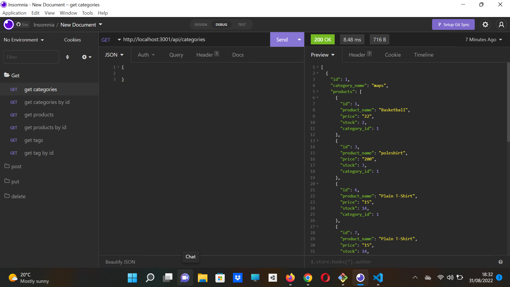

 # e-commerce
 This is the backend of an E-commerce site. it has database models of categories , products, and tags, routes are created to perform various CRUD functions.

  
  ## Description:

  

    .

  # Table of Contents

  - [Walkthrough](#walkthrough)
  - [Installation](#installation)
  - [Usage](#usage)
  - [Credits](#credits)
  - [License](#license)
  - [Contribution](#contributing)
  - [Screenshot](#screenshot)
  - [Contact](#contacts)

  
  ## Installation:

  run ```npm install``` in terminal to install the dependencies. 
  run ```source schema.sql``` in sql to create database
  type ```node server.js``` in the console to localhost server.
  use insomnia to perform crud functions.

  ## Walkthrough
  [WalkThrough Video]()
  
  ## Technologies
  - JavaScript
  - Nodejs

  ## Usage:


  This app will let you create rest api for backend e-commerce 


  ## Credits:

  Made by Bader Munir


  ## License:

  For more information about licenses, please visit:

  [License](https://opensource.org/licenses/MIT)


  ## Contributing:
  
  It is open source

  ## Screenshot:

  

  
  ## Contact:

  - [Github Profile](https://github.com/XBaderM)

  - [Email](bader.munir18@googlemail.com)
  
 

